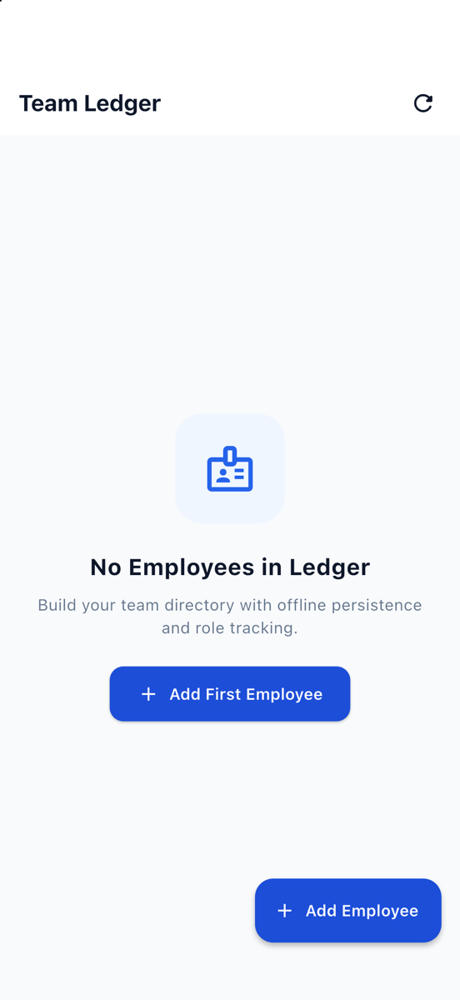

# Employee Ledger

An offline-first team directory and employee management application built with Flutter, BLoC state management, and Sembast NoSQL local storage.

[](https://flutter.dev/)
[](https://dart.dev/)
[](https://bloclibrary.dev/)
[](https://pub.dev/packages/sembast)
[](LICENSE)

---

## Live Web App

The Flutter web build is deployed and accessible on GitHub Pages:  
**[https://ghost-9.github.io/employee-ledger/](https://ghost-9.github.io/employee-ledger/)**

---

## Screenshots

<div align="center">
  <table>
    <tr>
      <td width="50%" align="center">
        <strong>Team Directory & Metrics</strong><br /><br />
        
      </td>
      <td width="50%" align="center">
        <strong>Add / Edit Employee Form</strong><br /><br />
        
      </td>
    </tr>
  </table>
</div>

---

## Features

* **Headcount Metrics:** Summary cards displaying Total Team, Currently Active, and Alumni members.
* **Instant Search & Status Filtering:** Search by name or job title with segment pills (`All`, `Active`, `Alumni`).
* **Offline-First Persistence:** Powered by Sembast NoSQL (IndexedDB on Web, SQLite file on iOS/Android) for instant local read/writes without network dependency.
* **BLoC Architecture:** Strict separation of UI and business logic with `EmployeeBloc`, events, and immutable states.
* **Keyboard-Aware Form Layout:** Bottom action buttons pinned safely to prevent viewport squishing on mobile keyboards.
* **Comprehensive Testing:** Unit and widget test suite covering BLoC states and directory interactions.

---

## Project Structure

```
lib/
├── bloc/                 # BLoC events, states, and business logic
├── database/             # Sembast database abstraction & CRUD methods
├── models/               # Employee data entity and serialization
├── screens/              # Directory dashboard and employee form screens
├── widgets/              # Metric cards, search bar, and member tile components
└── main.dart             # App entry point, repository providers, theme
test/
├── bloc_test.dart        # BLoC unit tests
└── widget_test.dart      # UI widget tests
docs/
└── screenshots/          # Application screenshots
```

---

## Getting Started

### Prerequisites
* Flutter SDK (3.24+)

### Run Locally

1. Clone the repo:
   ```bash
   git clone https://github.com/Ghost-9/employee-ledger.git
   cd employee-ledger
   ```

2. Fetch packages:
   ```bash
   flutter pub get
   ```

3. Run tests:
   ```bash
   flutter test
   ```

4. Run on your target platform:
   ```bash
   # Web
   flutter run -d chrome

   # iOS Simulator
   flutter run -d iPhone
   ```

---

## License

This project is licensed under the [MIT License](LICENSE).
