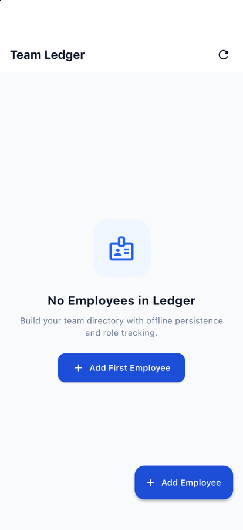

# Employee Ledger · Enterprise Team Management PWA

<p align="center">
  <strong>An offline-first, executive team directory and employee ledger built with Flutter & BLoC.</strong><br />
  <em>Featuring instant local persistence via Sembast (IndexedDB / SQLite), real-time search, tenure analytics, and an Apple-inspired design system.</em>
</p>

<p align="center">
  
  
  
  
  
  
</p>

---

## Visual Showcase

<div align="center">
  <table>
    <tr>
      <td width="50%" align="center">
        <strong>Directory & KPI Metrics (iOS Simulator Retina)</strong><br /><br />
        
      </td>
      <td width="50%" align="center">
        <strong>Employee Form & Role Assignment (iOS Simulator Retina)</strong><br /><br />
        
      </td>
    </tr>
  </table>
</div>

---

## Live Progressive Web App (PWA)

Experience the live deployed application in your browser:  
👉 **[https://ghost-9.github.io/employee-ledger/](https://ghost-9.github.io/employee-ledger/)**

---

## Design System & UX Highlights

* **Executive Ledger Aesthetic:** Clean Slate surfaces (`#F8FAFC`), crisp typographic scale, subtle borders (`#E2E8F0`), and balanced whitespace.
* **Live KPI Intelligence:** Immediate headcount metrics displaying **Total Team**, **Currently Active**, and **Alumni** counts.
* **Instant Substring Search & Segmentation:** Live name & role filtering combined with one-tap status tabs (`All`, `Active`, `Alumni`).
* **Dynamic Monogram Avatars:** Deterministic color hashing generating distinctive initials badges for every team member.
* **Precise Tenure Computation:** Automated calculation of employment duration (e.g. *2 yrs 4 mos*) for both active staff and alumni.
* **Fluid Gestures:** Swipe-to-delete with confirmation feedback and undo capabilities.
* **Safe-Area Sheet Design:** Full keyboard-aware forms and bottom sheets preventing overflow on modern mobile displays.

---

## Architecture & State Pipeline

```
lib/
├── blocs/
│   ├── employee_bloc.dart       # Event-driven business logic orchestrator
│   ├── employee_event.dart      # LoadEmployees, AddEmployee, UpdateEmployee, DeleteEmployee
│   └── employee_state.dart      # EmployeeInitial, Loading, Loaded, Empty
├── models/
│   └── employee.dart            # Equatable data model with JSON serialization
├── services/
│   └── database_helper.dart     # Sembast NoSQL engine (IndexedDB on web, filesystem on mobile)
├── utils/
│   ├── colors.dart              # Modern design tokens, semantic statuses, Material 3 theme
│   ├── constants.dart           # Standardized departmental role taxonomy
│   └── utils.dart               # SnackBar feedback and UI utilities
└── screens/
    ├── add_employee_screen.dart # Cupertino-inspired employee intake & timeline editor
    └── main.dart                # Executive team dashboard, KPI bar & responsive list
```

---

## Getting Started

### Prerequisites
* Flutter SDK (3.x or higher)
* Dart SDK (3.x or higher)

### Run Locally
```bash
# Clone the repository
git clone https://github.com/Ghost-9/employee_management.git

# Enter project directory
cd employee_management

# Install packages
flutter pub get

# Run test suite
flutter test

# Launch on Chrome (PWA mode)
flutter run -d chrome

# Launch on iOS Simulator
flutter run -d ios
```

### Production Web Build
```bash
flutter build web --release
```

---

## License

This project is licensed under the [MIT License](LICENSE).

<div align="center">
  <sub>Crafted by <a href="https://github.com/Ghost-9">Mayank Batra</a></sub>
</div>
